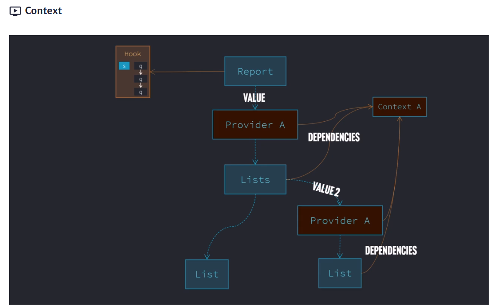
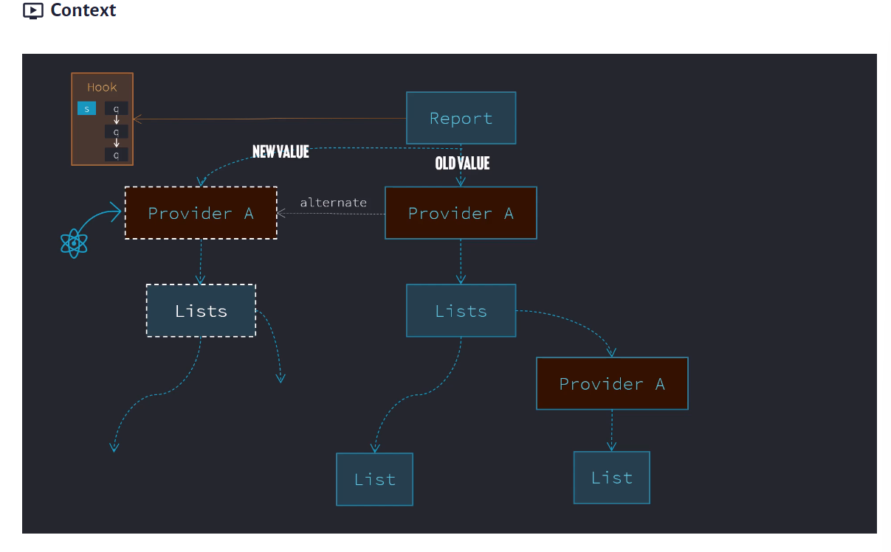
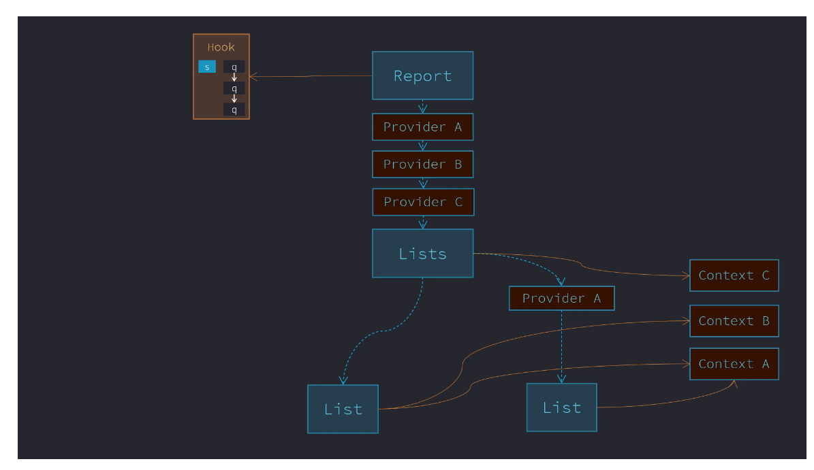
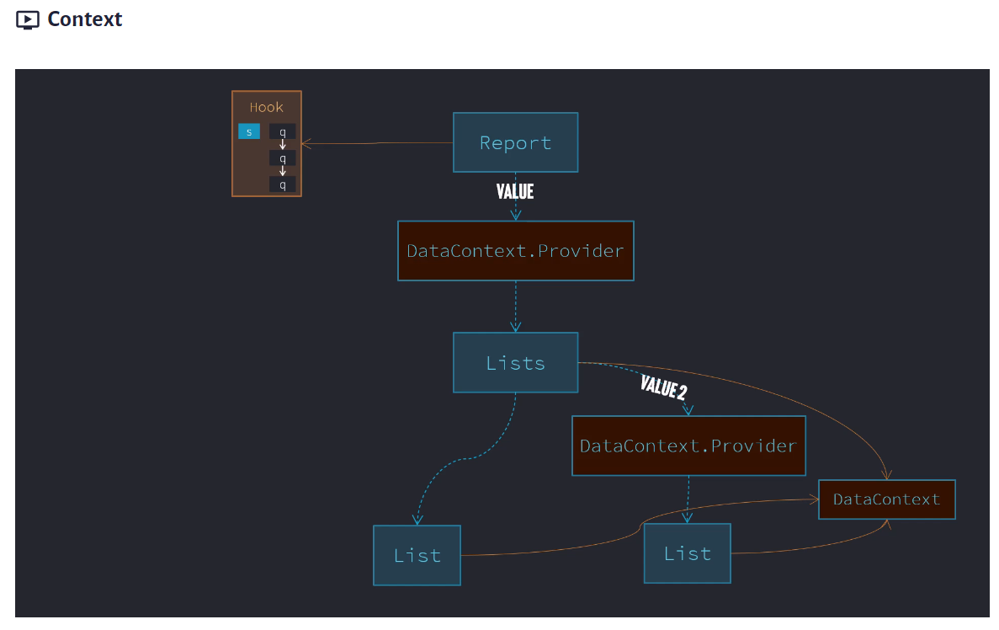
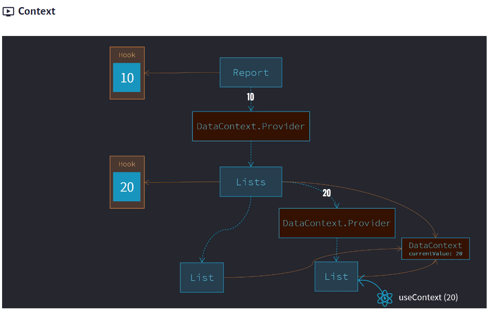
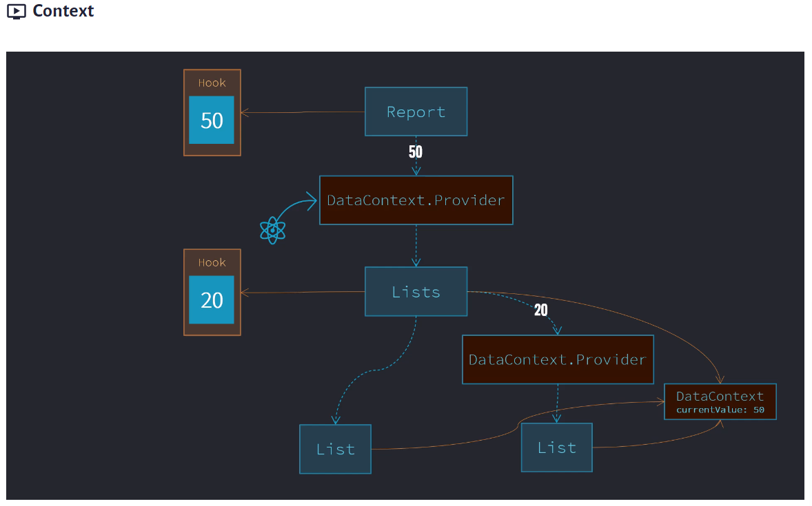
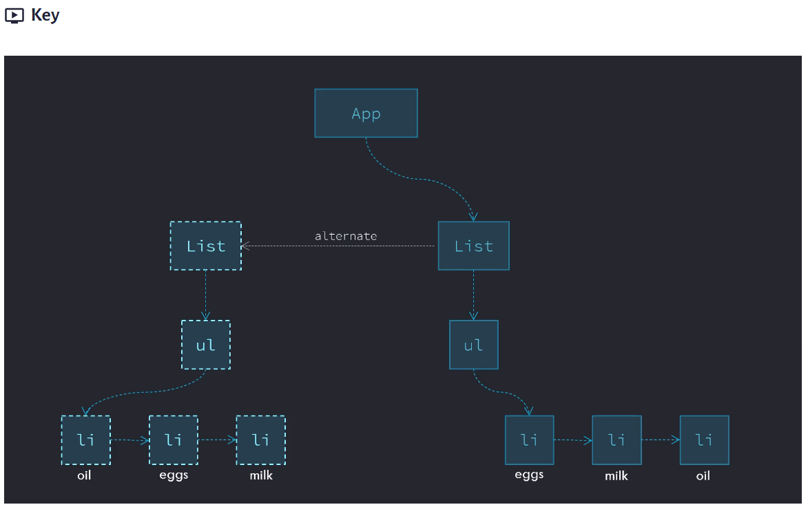
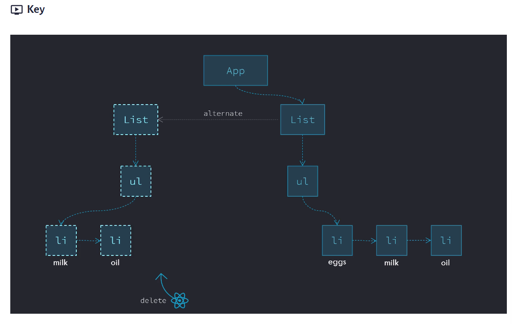
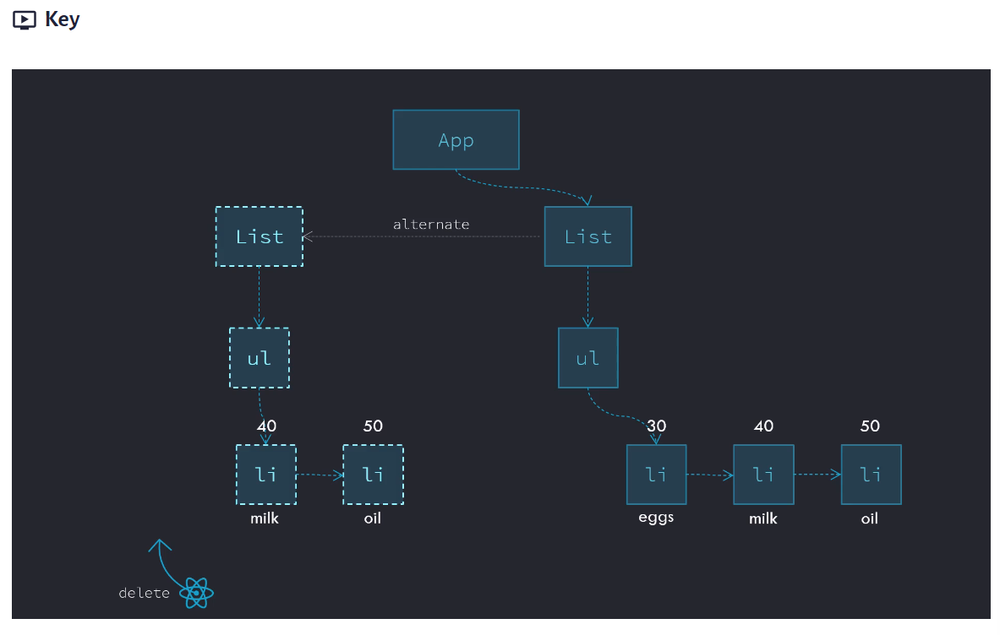

# React Training
React Training by Tony Alicea

React source code is open source:
https://github.com/facebook/react

React is other people's javascript code. Its not a blackbox.
DOM and Declarative Programming
```html
<section>
<ul>
<li>Section 1</li>
<li>Section 2</li>
<li>Section 3</li>
</ul>
</section>
```

All of these elements form part of a tree.
When the browser reads in the text file(html file), it renders objects in computer memory in form of a tree. These objects have references to one another. It is a tree of objects. This tree models what was there in the document. This is known as the document object model (DOM).

DOM: Collection of objects in the computer's memory that represent the HTML elements that define a webpage. It provides the ability to analyze and change the document being presented to the user.

DOM: (inverted) tree data structure
Root is at the top
Root --> Parent -->Child

HTML is a text file which is read in -->
Browser converts it into the DOM -->
Collection of objects in computer memory -->
Browser takes these collection of objects and paints(renders) the web page to the user screen.

DOM Manipulation
We can change the DOM tree
When the DOM tree is changed, the browser re-renders the webpage.
Browser APIs are the endpoints through which our user code can talk to the browser code

Lets say we want to append a child to an element in HTML. It is not a standard javascript function. It is provided by the browser that we can call from our javascript code. It causes our DOM to re-render.

We have 2 types of engines:
1. Javascript Engine (C++)
2. Rendering Engine (C++)

Both engines sit inside the browser. Using Javascript code we can provide them with instructions to manipulate the DOM via Browser APIs

When we write <script src="./app.js"/> inside the body tag, it ensures that DOM elements have already been created when this javascript is run.


## Building dynamic web applications means manipulating the DOM.

Manipulating the DOM is an expensive task.
We need to minimize the work at manipulating the DOM.
     
## IMPERATIVE VS DECLARATIVE PROGRAMMING

1. IMPERATIVE PROGRAMMING: Style of programming in which we describe how a program should do its task:
For e.g how a dog should tie its shoes

2. DECLARATIVE PROGRAMMING: Style of programming in which we declare what we want the program to accomplish without describing how.

**DECLARATIVE PROGRAMMING SYSTEM IS BUILT ON TOP OF IMPERATIVE PROGRAMMING.**

## We rely on programming done by other developers

In simple words, **React Code is imperative programming** i.e it has the code with instructions as to how to update the DOM.

Declarative programming is what we as developers, do. We just need to write code for our business logic and react code takes care of providing a set of instructions to the browsers as to how to render it. 

It makes our life easier so that we can focus on what our application should do rather than bothering about how it will do it.

# React Elements
- Recursion: A function that calls itself. Can cause stackoverflow exceptions.
- Recursion is a common way of traversing through a tree data structure. 
- While traversing we move from element to element, that is from parent to child to sibling etc.
- In React we are dealing with trees, so we traverse down the tree.
- React avoids recursion as much as it can
 
  ```javascript
    function a()
    {
        if(...)
        {
            a();
        } else
        {
            return;
        }
    }

  ```
  ## POJO(Plain old javascript objects)
  - Simple collection of name/value pairs
  - A virtual DOM is also like a POJO
  - It has various elements that are rendered on a page expressed as a POJO object
  - Then we can have something like a render function that traverses the virtual DOM object and updates the real DOM. 
  - There could be efficient ways of doing this as well. We dont necessarily have to go through each and every element inside a virtual DOM and neither do we need to recreate the page again from scratch. 
  - Example of react virtual DOM is given below. Also find a function that recursively goes through all the elements of the virtual DOM(POJO object) and renders it on a page
  - Here the markup object represents the virtual DOM. This is a tree like object and looks like declarative code
  - addElements() is a method that takes the input of the markup object and the parentDOM object and renders it on the page
  

  ```javascript
    // Example of a virtual DOM
    // Looks like declarative code
    // Tree like structure
    let markup = {
        type: 'article',
    children: [
        {
            type: 'h2',
            children: [
                {
                    type: 'text',
                    value: 'Counter'
                }        
            ]
        },
        {
            type: 'h3',
            children: [
                {
                    type: 'text',
                    value: 'This works'
                }        
            ]
        },
        {
            type: 'p',
            children: [
                {
                    type: 'text',
                    value: 'Counter'
                },
                {
                    type: 'strong',
                    children: [
                        {
                            type: 'em',
                            children: [
                                {
                                    type: 'text',
                                    value: '1'
                                }        
                            ]
                        }        
                    ]
                },
                {
                    type: 'text',
                    value: 'times'
                }      
            ]
        },
        {
            type: 'button',
            children: [
                {
                    type: 'text',
                    value: 'Click me'
                }
            ]
        }
    ]
    }

    console.log(markup)

    // Need imperative code to make declarative code work
    // Real DOM Object
    const main = document.getElementById("app");
    console.log(main)

    // method to add the elements to the real DOM from the POJO object
    // this is how we add elements from virtual DOM to the main DOM
    function addElements(pojoElement, parentDOMNode)
    {
    let newDOMNode = pojoElement.type === 'text' ? document.createTextNode(pojoElement.value)
                    : document.createElement(pojoElement.type);
    if(pojoElement.children)
    {
        pojoElement.children.forEach((child) => {
            addElements(child,newDOMNode)
        });
    }
    console.log(parentDOMNode);
    parentDOMNode.appendChild(newDOMNode);
    }

    addElements(markup,main);

  ```
  
  ## Creating React Elements
 - We need to understand the POJO objects that React makes
 - A tree of React elements is a tree of simple objects with defined types like function or strings.
 - If it is a function, it calls that function
 - React.createElement() is declarative but React made it work imperatively
 - It creates a virtual DOM first and then it updates the real DOM.
  
  ## React Element Tree
  - Data structure of POJO objects
  - DOM Objects are itself complex objects used by browser to render the webpage.
  - React Element Tree are simple objects used by React's code that represent the DOM tree. 
  - React Element tree is a fake tree(virtual) and is simplistic.
  - It just gives an idea of what real tree should look like
  - DOM tree is a real tree that users interact with
  
  - To create a React Element tree do this:

  ```javascript
    const rootNode = document.getElementById("app");
    const root = ReactDOM.createRoot(rootNode);
    root.render(React.createElement(App));

    function App()
    {
            // console.log("Called App")
        return (
            //  React.createElement("button",null,"Click me")
            React.createElement("article", null,
            React.createElement("h2",null,"Counter"),
            React.createElement("p",null,"You clicked 1 time(s)"),
            React.createElement("button",null,"Click Me"))

            )
    }
  ```

### DOM Element References
- document.getElementById() helps to get the DOM Object
- gets the location of the object in the computer's memory

### React Elements and DOM Elements(From POJOs to the browser)
- Virtual DOM vs Real DOM
- Tree of React Elements(what we want to DOM look like) vs Tree of Real Elements(which user sees on his screen right now)
- Imperative programming needs to update the Real DOM from the Virtual DOM
- React creates a React Element Tree
- React code runs after the Javascript code has run. It works asynchronously
- It does so so that it doesnt block the code or doesnt block the user

```javascript
// before React does it work
// React works asynchronously
// React waits for Javascript engine to be available
// React exhibits this behaviour on purpose, so that it doesnt block the user or doesnt block the code
// It waits for the rest of our javascript code to be run before doing its work
let articleElements = document.getElementsByTagName("article");
let articleElement = document.getElementsByTagName("article").item(0);
console.log(articleElements);
console.log(articleElement);

//after React does it work
setTimeout(()=>{
    let articleElements = document.getElementsByTagName("article");
    let articleElement = document.getElementsByTagName("article").item(0);
    console.log(articleElements);
    console.log(articleElement);
},2000)
```

# React DOM Updates
- Declarative coding stands on shoulders of imperative coding
- React has imperative code which allows us to write declarative code
- React DOM file has the imperative code to render the element in the browser
- So when we declaratively create a React Element using React.createElement(), the react library transforms that into a set of instructions(imperative code) for the browser
- We know React Virtual DOM is a POJO object. So does react create all the elements from the virtual DOM into the real DOM one by one?
- The answer is NO. It first builds the object tree internally and renders it one time. The idea is to minimize the DOM refreshes as not only it is an expensive operation but it gives poor user experience. 
- So if we have an article tag with h2, p, button tags inside it, react first builds the article tag with all its child elements inside it inside the virtual DOM
- Then it updates the real DOM only once.
  
# Components
- It is React's job to update the DOM
- We tell React how to update the DOM
- Component: In react, a function component is a function that returns a React element(which may contain other React Elements). It is intended to be called by React
- Components are reusable, but we dont usually reuse everyone.
- In react everything is a component
- Everything is a piece of what we want the React Element Tree to look like
- Components promote reusability and the DRY principle
- React components are implemented through functions
- Each function is converted into a react element object
- React goes through the React Element tree and calls each function for the Component. It checks for the type of the elements and acts accordingly
- If the element is a type of function then React will call it
- React chooses to define components as functions
- These functions return React elements
- React call functions and functions return react elements which may have children and then react then does the imperative work to match our declarative statements of what the DOM should look like.

## Pure Functions
- A pure function is a function that for the same inputs gives the same output and causes no side effects.

```javascript
let counter = {name: 'Counter'};
let counterValue = 1;


//Pure function
//Has no side effects
function pureCounter(ctr,value)
{
    return `${ctr.name} ${value}`;
}

console.log(pureCounter(counter,counterValue));
console.log(pureCounter(counter,counterValue+1));
console.log(pureCounter(counter,counterValue));

//Here we have mutated the ctr object
//ctr object is passed by reference so it results in a different value each time
//Here we are updating the global value rather than the value passed to me
//Here for the same set of inputs we get different outputs
//Impure functions are buggy, difficult to maintain code
//React has features to ensure our function components are pure
function impureCounter(ctr,value)
{
    ctr.name = ctr.name + ' Nishant';
    counterValue = counterValue + 1;
    return `${ctr.name} ${value}`;
}
console.log('----')
console.log(impureCounter(counter,counterValue));
console.log(impureCounter(counter,counterValue+1));
console.log(impureCounter(counter,counterValue));
console.log(counter)
```

# Props
- Props are function arguments
- When react goes through the react element tree and it sees a function component, it calls that function
- Functions can be passed arguments
- Props are arguments that are passed to these functions
- Same function component can be used to generate different sub-trees
- Makes components flexible and reusable
- props are immutable
- Cannot be changed
- props is used with Object.isFrozen(props) inside react
- The reason why props are immutable because it create pure functions
- ***Remember impure functions lead to buggy code and cause side effects, react fixes this by forcing us to have immutable props and thereby creating pure functions***
- Helps react to behave in predictable way
- Please note that destructuring the props is useful, but then we can change the individual properties inside it, so then it can make our functions impure and cause side-effects
  
  ```javascript
    function Counter({name})
    {
    //console.log(props)
    //console.log("Called App")
    return (
        //React.createElement("button",null,"Click me")
            React.createElement("article", null,
            React.createElement("h2",null,"Counter ",name),
            React.createElement("p",null,"You clicked 1 time(s)"),
            React.createElement("button",null,"Click Me"))
           )
    }
  ```
# Template Logic
- In real applications we need logic to make our applications dynamic and response to user inputs

```javascript
let counterName = "One"
root.render(React.createElement(App));
//console.log(React);

function App()
{
    return React.createElement("section", null, 
        React.createElement("h1", null, "Counters"),
        React.createElement("section",null,
           counterName === "One" ? React.createElement(Counter,{name:counterName})
                                 : React.createElement(Counter2,{name:counterName})
            // // add another counter
            // React.createElement(Counter,{name:"Two"})
        )
    );
}


function updateFn()
{
    console.log("Updating..");
    counterName = "Two"
    //Force react to re-render
    root.render(React.createElement(App));
}
```
- Please note when we click on updateFn() and force the DOM to re-render, it did do append child to container, it actually did only appending child
- When we force the DOM to re-render, react compares the Real DOM to the Virtual DOM and only replaces those elements on the Real DOM which have changed as per the Virtual DOM. This is very efficient.
- React has the ability to look at the existing DOM and make intelligent decisions as to how to update it.
- It compares the 2 trees and makes the change
- React element tree is very lightweight...its just POJOs
- This comparison is not a very expensive operation

# Element Properties and DOM
- For now we have been creating React Elements using the following code:
  ```javascript
    React.createElement("h2",null,"Counter"),
  ```
  - What we are passing as null above, is actually the set of attributes we can define for the HTML element h2
  - We can pass name attribute, classname attribute or any other attribute applicable to h2 element


    ```javascript
     React.createElement("button",{className:"button",name:"NishantButton"},"Click Me"))
    ```
    - React.createElement() is a function and we are passing an object as props to it. 
    - We can specify the attributes within that props object and React will automatically update the real DOM with the attributes that we have specified inside that object for that particular element
  

  # JSX

 ***Markup and Tree Creation shorthand***
 - In react we create lot of tree data structures
 - In react the challenge was to how to write these trees easily
 - But we also want to include some logic and javascript code while creating trees
 - Transformation and Transpilation: Transforming (changing) the text of code written in one syntax and converting it to a different syntax that does the same thing.
 - Sometimes a "transpiler" is referred to as "transformer"
 - Makes the life of developers easier
 - Markup is not part of javascript syntax
 - Transpilation allows us to write the code in an easier way
  
# React Elements and JSX
- Just a shortcut for creating and writing POJOs
- JSX is an XML like syntax extension to ECMAScript without any defined semantics.
- What does semantics mean? For e.g HTML elements need to have certain meanings(semantics). This means "ol" stands for ordered list, "a" stands for anchor tag and so forth
- But JSX doesnot have any of these defined semantics. We can create our own semantics(or our own tags) like "specialTagByNishant"
- JSX is not HTML inside javascript. It is a markup language with no defined semantics.
- JSX is a generic way of writing tree data structures as part of a javascript file.
- JSX is not even meant to run inside a browser. It is to be used by various transpilers to transform its tokens(or tags) into standard ECMAScript(or Javascript)
- JSX is just shorthand to do our job faster
- Writing trees is most easiest using markup
```javascript
// Using JSX to express UI components
var dropdown  = <Dropdown>
    A dropdown list
    <Menu>
      <MenuItem>Do Something</MenuItem>
      <MenuItem>Do Something Fun!</MenuItem>
      <MenuItem>Do Something Else</MenuItem>
    </Menu>
  </Dropdown>;

  render(dropdown);
```
- Good thing is JSX is not a string but markup language
- JSX stands for Javascript syntax extension or Javascript XML

```javascript
const rootNode = document.getElementById("app");
const root = ReactDOM.createRoot(rootNode);
root.render(React.createElement(App));

function App()
{
    return (
    <section>
        <h1>Counters</h1>
        <section>
            <Counter/>
        </section>
    </section>
    )
}

function Counter()
{
    return (
    <article>
        <h2>Counter</h2>
        <p>You clicked 1 times</p>
        <button className="button">
            Click Me!
        </button>
    </article>
    )
}
```
- Here, above, we have removed React.createElement() and written JSX.
- As we can see it is simple to write and understand.
- But browser will not understand it directly.
- It will first transpile it to Javascript using Babel compiler and then only render it
- Careful authored HTML is easier to read and maintain
- Please note that div is not a container
- React functions return only a single element
- div element has no special meaning. It only represents its children.
- div is an element of the last resort.
- Deeper our DOM tree, slower is the performance of our page
- Dont add too many layers to the DOM tree
- Instead of div use React fragments like <></>
- React fragment is not added to the real DOM

# Fiber and Reconciliation

### Root Creation and Render
- All code in React begins with the definition of a root node
  ```javascript
    const root = ReactDOM.createRoot(rootNode);
  ```
- This initializes a tree data structure which will have children appended to it
- Linked List is a simple data structure that creates a line of items that are linked to each other. It has a pointer to the next element. We have doubly linked list also. It is very light of memory. It is easy to traverse a linked list
- In React we have Fiber Nodes and Fiber Trees
***In addition to DOM Element Tree and React Element Tree, we have the Fiber Tree***
- Fiber Tree are simple objects used by React Tree to store information and determine what work needs to be done
- React Element Tree is disposed of and re-rendered but React Fiber Tree is not destroyed or recreated, rather it is updated
- React Fiber Tree is used to store state
- React Fiber Tree can be used as a middleman between DOM Tree and React Tree. It can be used to determine what needs to be rendered on the actual DOM tree and best way to make them.
- Fiber Tree uses Linked Lists and is very lightweight
- Reason why we use 3 trees is to make React as lightweight as possible.
- Fiber Tree is essentially a copy of the React Element tree at a particular point of time
- In react fiber tree we have updateContainer() method
- Basically this tree structure is defined using LinkedLists
- All features of React are built on top of Fiber Tree
- For all of our DOM elements, React adds a reference to the Fiber Nodes
- Fiber Nodes also have references to the DOM
- Tree Reconciliation and Tree Edit Distance Problem: Reconciliation means comparing 2 items to find difference between them
- We compare 2 trees or portion of trees and finding the steps to make them match.
- Tree Edit Distance Problem: What is the algorithm to find the smallest number of steps to change one tree to match another?
- Finding the number of steps is important as we want to minimize the number of steps to convert React Element Tree to DOM Tree.
- Methodology(Algorithm) to find minimum of steps should also be very efficient.
- We only define our React Element tree with JSX, React does all the above work.
- Fiber tree matches the current state of the DOM Tree, React Element tree tells us what the tree should look like(declarative)
- Think of Fiber tree as an area where we can do rough work. It is like a small model of the DOM tree where we can try our changes before we make changes to real DOM tree.
- When React Element Tree changes, the portion of tree that has changed is first rendered on the Fiber Tree
- When the React Element Tree changes, React attaches the changes to the Fiber tree as a work in progress branch or alternate branch.
- Then when the work is done, the alternate or work in progress branch becomes the main branch and the earlier main branch becomes the work in progress or alternate branch.
- Fiber tree is basically a combination of the real DOM tree and what we want the DOM tree to look like as represented by the React Element tree.
- How does React make the decision to go from React Element Tree to real DOM tree --> This is done through Reconciliation and Work: What needs to be done and how?
- Fiber tree contains pieces of the re-rendered DOM tree.
- React implements a reconciliation algorithm.
- This reconciliation algorithm looks at the current tree and the work in progress tree and figures out the steps that are needed to take on the "Real" tree.
- React makes a plan of what to do using the Fiber tree and executes that plan using the real DOM tree and then that is displayed on our screen.
- Fiber tree is not destroyed so it is used for lot of other fundamentally important things within React.
- Fiber tree is end of the day used to carry out reconciliation between the DOM tree and React Element tree.

# Execution Contexts and Pausing Works
- Execution Context and Event Loop
- All javascript code is run inside an execution context. There is the Global function which runs the user function
- In the browser, there is a queue of events as well. 
- Javascript Engine which resides inside the browser contains the Execution Stack and Queue.
- Javascript brings the code from the queue when the call stack is empty.
- React doesnot interrupt the code that is being executed.
- React keeps track of the code that is being executed.
- Fiber and Custom Execution Context
- React has its own execution contexts like BatchedContext, RenderContext, CommitContext.
- React runs its code inside its own execution context.
- React tells the browser that when it done executing other code, it can execute code provided by React
- React can pause its work and splits it work and tell the browser accordingly so that the rendering process is very efficient.
- What happens inside a Fiber tree doesnot happen all at once.

# Units of Work and the Work Loop
- Whatever work React needs to do it needs to pause, start, continue and basically allow the browser to continue doing its work. 
- End of the day React has to get its work done.
- React looks at the fiber tree and determines what needs to be done. For e.g do we need to add an element or remove an element. All of this is known as unit of work.
- React does all of this inside a work loop
- Equality on Javascript: This is a tricky concept.
- React only does work when something changed.
- Object.is(a,b) --> Checks if a and b are equal (by reference)

# Beginning, Completing, Bailing Out and Pausing Work
- Organizing Work
- Memoization: Store the result of a computation so that we dont have to repeat the computation itself.
- memoized Props means the values that were passed to the function
- if there is no work to be done we can do bailing out. React is trying to be efficient.
- In React Unit of Work, we can begin, bail out and complete our unit of work.
- React organizes work well so it has places where other things can be done.
- Inside the work, it can choose not to execute the work till certain things happen on the browser.
- React helps the app to appear fast in the browser.
- React moves through the fiber tree and does work using the nodes of the fiber tree.
  

  # Lanes and Priority
  - Lanes are how react prioritizes the work
  - We can order the work using Lanes
  - We have functions like getHighestPriorityLanes
  - Also we have offscreen lanes--> means lowest priority work
  - React ensures our application renders to the user as quickly as possible.
  
  # React DOM and Rendering
  - We have 3 trees: React Element Tree, Fiber Tree and real DOM tree
  - React does work to match the Fiber Tree to the React Element Tree and then finally updates the DOM tree based on the Fiber tree.
  - Each step of the process called a unit of work is done at different points of time. 
  - Rendering essentially means reconciling the DOM tree and the Fiber tree.
  
  # Mounting, Updating and Unmounting in React
  - Hanging and removing
  - Mounting a component: In Fiber tree each component is a reference inside of a Fiber Node. The component itself will return React element objects which are converted into Fiber Nodes.
  - Reconciliation process is completed when the act of adding the DOM Nodes to the real DOM tree based on a particular component is known as mounting of a component. Basically the DOM nodes have been attached based on what the component should look like
  - Later Fiber tree may get a work in progress update where the component is updated
  - Component may be removed from the Fiber Tree and corresponding DOM nodes are removed so the component is unmounted.
  - Unmounting a component doesnot necessarily mean the component is removed from the DOM tree. It depends on what the Fiber tree looks like. It also depends on the reconciliation algorithm.
  - If the Fiber Node has a reference to the real DOM element, it means the component has been mounted to the real DOM tree.
  ***This is also known as React Lifecycle***
  - React allows us to carry our own code at different points in the lifecycle.
  - React lifecycle methods are hooks that allow you to run code at specific  points in a component's life. Here's a quick rundown:

    1. Mounting: When a component is being inserted into the DOM.
    - constructor(): Called before anything else. Great for setting initial state or binding methods.
    - componentDidMount(): Invoked immediately after a component is inserted. Ideal for fetching data or integrating with other libraries.

    2. Updating: When a component is being re-rendered due to changes in state or props.
    - shouldComponentUpdate(): Lets React know if re-rendering is necessary. Often used for performance optimization.
    - componentDidUpdate(): Called after updates. Useful for making network requests or updating the DOM based on the previous props or state.

    3. Unmounting: When a component is being removed from the DOM.
    - componentWillUnmount(): Used to clean up resources like event listeners or timers.

    4. Error Handling: Invoked when there's an error during rendering, in a lifecycle method, or in a constructor.
    -   componentDidCatch(): Allows you to handle errors gracefully.

***And now with Hooks, you get functions like useEffect() which combines lifecycle stages into a single API.***

# Events
- We need to deal with Events in React also
- DOM Events
- In javascript we add Event Listeners and define handlers like onClick() event handler(this is how browser implements dealing with user interaction)
- We can have multiple listeners
- Browser does something called event bubbling
- Handling the event on the innermost element and then moving up through the ancestors to handle the event.
- Lets say we have a ul --> li -->a-->a-->button
- If a has a click event then it is executed,  if li has a click event also, it is also executed, if ul has a click event, that is also executed
- Event Capturing: Handling the event on the outermost element, and then move down through the descendants to handle the same event
- so ul handles click first, then li and then a
- Capturing is rarely used.
- Built in way is using event bubbling.
- Event Propagation: Transmitting something in a particular direction through a medium. Basically it means event bubbling and event capturing. Moving the event through the DOM Nodes.
- Event Delegation: Assigning an event handler to an ancestor node in the tree.
- Lot of listeners are inefficient
- For large DOM trees, we can put a single listener on a single root element in hope that that element will receive the event.
- Instead of having multiple handlers for different buttons, react helps us. Rather than writing code for each button, React helps us by using React Event Objects

# How does React help us to work with Events provided by the browser

- React Event Objects
- React's approach to handling events is to use event delegation and then let us specify the individual targets on the events we want to handle
- React delegates all the events to the root of our DOM
- There is a listener at the root
- Event that was passed was not a DOM event
- It passes a synthentic base event which is a javascript object that react created. It has a target which is the button
- This synthentic base event is wrapper over the DOM(native) events and is also referred to as the React Event Object

## Synthentic Event Properties and Methods
- event.preventDefault(); --> This prevents the default behaviour
- event.stopPropagation(); --> Stops the bubbling of events
- Events and DOM updates are related through state.
  
# React State
- State: In the context of software, the data at any given time that describes the current state or condition of the system
- Finite State Machine: A model of a process that can be in a limited number of states. 
- It models the states, the inputs and the transitions between states in response to the inputs
- Deterministic: A predictable process that in the context of state machine always gives the same output given the same inputs and state.
- Pure functions help to make sure our state machine is deterministic and it remains consistent and predictable
- User Interface reflects the state of the system
- The underlying state machine must be deterministic, consistent and reliable.
- Functions we use to change state must be pure.
- User Interface is a function of state.
- By giving the same state to our components should give us the same React Element Tree.
## Reducers
- Functional programming is a style of programming where we organize our code into pure functions. React borrows a lot of concepts from functional programming.
- Our components are pure functions

## Actions and State
- Action is a description of what has occurred in an app and how state changes as a result
- Action is a very neat way of what is going on in my application.
- Anything that happens in our application is a sequence of actions


# Hooks and State
- Fiber tree is a good place to store state since it stays around
- Hooks is like attaching something to the tree
- Hook is attached to a branch of the tree
- State is stored inside hooks
- Hooks are directly connected to the fiber tree
- They are hanging off the nodes
- Each fiber node has lot of different properties and one of them is memoizedState. State ends up being a javascript object called a hook
- Hook is a javascript object
- Each fiber node can have a hook attached it and each hook can have another hook attached to it. These hooks are stored inside a linkedList. Hooks are lightweight data structure.
- These hooks are attached to the node of the tree
- Queue: FIFO data structure
- Each fiber node also has an updateQueue
- Each hook has state and queues
- This means a hook can have a list of items that can lined up and then we can flush the queue (Flushing means empty the data structure of its data and deal with its data)
***React can batch updates***
- Batching is processing multiple tasks as a single group. We may request the state to be updated in multiple hooks within our component. 
- React can choose to update all those hooks as one process rather than process each hook one at a time
- When state changes, UI should change
- What does react do? It updates the DOM tree based on React Element Tree defined inside the component with the Fiber Tree in-between
- So if the state changes, do we ask React to update each time ?
- We know that the tree is an output of state. So if the state changes, then the tree atleast should be checked to see if it should change or not
- We only need to re-render that piece of the tree where the state has changed.
- So if state in the hook attached to the list component changes, then list component should be re-rendered. Similarly if the state attached to the Counter component changes, then counter component should be re-rendered or its tree should be updated.
- If we change the state programmatically, react automatically knows that the state has changes so it should re-render the tree, in other words our function components should be executed again to see if the final output is different.
  
# useReducer Hook
- Most basic hook for managing state
- Dispatch: Sending the action to the reducer. Action has happened so reducing function should be called to get the new state.
- useReducer hook takes 2 arguments: one is the reducing function and other is the initial state. It returns the reference to the memoized state inside the hook and a reference to the dispatch function. 
- const [state, dispatch] = React.useReducer(()=>{},{clicks:0})
- Here we use array destructuring to get the current state inside the hook and the dispatch function
- If we analyze useReducer, we can see that our component Counter has a hook attached to it. This hook stores the state and has a reference to the method dispatch
- We can then use this dispatch method to call the reducer
- The reducer in turn changes the state which is stored as memoized state in the fiber node
- If the state changes, then it will force the Fiber Tree to re-render which will force the Real DOM to change as well.


```javascript

//use the Counter component
function App()
{
    return (
    <section>
        <h1>Counters</h1>
        <section>
            <Counter name="One"/>
        </section>
    </section>
    )
}

function Counter(props)
{
    const [state, dispatch] = React.useReducer((state,action)=>{
        switch(action.type)
        {
            //state changes which forces component to re-render
           case 'Increment': return {...state,clicks:state.clicks+1} 
           default:
            throw new Error();
        }
    },{clicks:0})
    return (    
        <article>
        <h2>Counter {props.name}</h2>
        <p>You clicked {state.clicks} times</p>
        <button onClick={()=>{
            dispatch({type:'Increment'})
        }} className="button" >
            Click Me!
        </button>
    </article>
    )
}

```

# useState hook
- Commonly used hook in React
- useState() is a specialized version of useReducer()
- Main difference with useReducer() is that we dont really pass a reducer function
- We just pass the initial value. There is a built in reducer function for useState
- It is called a basicStateReducer
- This basicStateReducer looks at our action and sets that to the state
- state itself is the value of the action
- useState returns an array with two elements: the current state value (count in this case) and a function to update it (setCount).
- You can use the setCount function to update the state, and React will re-render the component with the new state value.
- Here setNumOfClicks is really a dispatch function
- useState is a wrapper for useReducer

```javascript
//use the Counter component
function App()
{
    return (
    <section>
        <h1>Counters</h1>
        <section>
            <Counter name="One"/>
        </section>
    </section>
    )
}

function Counter(props)
{
    const [numOfClicks,setNumOfClicks] = React.useState(0);

    return (  
        <article>
        <h2>Counter {props.name}</h2>
        <p>You clicked {numOfClicks} times</p>
        <button onClick={()=>{
            setNumOfClicks(numOfClicks + 1)
        }} className="button" >
            Click Me!
        </button>
    </article>
    )
}

```

***What if we now have 2 counters instead of one like this***

```javascript
//use the Counter component
function App()
{
    return (
    <section>
        <h1>Counters</h1>
        <section>
            <Counter name="One"/>
            <Counter name="Two"/>
        </section>
    </section>
    )
}

```
- Note that now there will be 2 branches of the fiber tree one for Counter 1 and another for Counter 2
- Each branch will have its own hooks attached it to the node of the fiber tree with each counter being its own node. So each one will keep track of its own state
- Each of the hooks will store their state separately.
- Changing the state inside the hook within one particular fiber tree will cause that branch to trigger re-render of the DOM and the other branch will remain unaffected.
- Which effectively means that each of the counters one and two will manage their own state without one overriding the other.
- Updating counter 1 should not trigger update of counter 2 component
- Undirectional data flow: Data can only move in one direction, in case of react downwards
- Parent is always calling the child
- Parent can give the child a reference as to how to update the parent data
- We use JSX to generate a React Element Tree which in turn generates a React Fiber tree which holds a linked list of hooks and ultimately thanks to reconciliation causes the DOM tree to be updated.

# Rules of Hooks
- Lets assume we have a functional component and it has various hooks inside it
  ```JavaScript
    function List(props)
    {
        useState(...)
        useReducer(...)
        useState(...)
    }
  ```
- When react is executing a component, it is also calling all the hooks inside it.
- These hooks are in the form of a linked list. For e.g above, the first item in linked list will be useState() followed by useReducer() followed by useState()
- React will execute hook 1 then move to the next hook and so on
- But there are some rules to using hooks

### Rules of using Hooks
- We can only call hooks from a component
- We can only use a hook inside a functional component
- hooks are objects attached to the fiber tree node created by our component
- It would not make sense to call them anywhere else
- You can only call hooks at the top level in your component and not inside a condition or loops
- To understand this look at the following code:

```JavaScript
function List(props)
    {
        useState(...)
        if(condition)
        {
            useReducer(...)
        }
        useState(...)
    }


```
- React will run the functional component and execute the first hook(useState)
- If state changes and the condition changes to false, react will skip call to useReducer()
- It will directly go and execute useState()
- Problem is hooks are stored as a linked list, so after the first useState() it will go to the next hook in line useReducer() and it will try to get the state there
- This is wrong and can lead to many bugs, therefore we can use hooks only at the top level in the component and not inside loops
- React gives error like this if we try to execute the above code: 
  ***React has detected a change in the order of Hooks called by Counter. This will lead to bugs and errors if not fixed***

  - Lets say we have a function to update state again and again inside the function
  
  ```javascript
    const [numOfClicks,setNumOfClicks] = React.useState(0);
    
    function handleClickWrong(){
        setNumOfClicks(numOfClicks + 1);
        setNumOfClicks(numOfClicks + 1);
        setNumOfClicks(numOfClicks + 1);
    }

    function handleClick(){
        setNumOfClicks(n=>n+1);
        setNumOfClicks(n=>n+1);
        setNumOfClicks(n=>n+1);
    }
  ```

  - In the above, due to closure functionality of javascript, the numOfClicks will always be passed and after the handleClickWrong() has finished executing the value of numOfClicks will be 1 only. This is cause the main functional component(Counter) has finished executing and value of numOfClicks is fixed to initial state which is 0
  - So even if we call setNumOfClicks 3 times, the value of numOfClicks will be 1 only
  - In the second case handleClick() function we use a function which has a property "n" defined in it. so setNumOfClick(n=>n+1) will pass updated value of n to the state (numOfClicks) each time it is updated
  - If we execute handleClick() function 3 times, the value of n after execution of that function will be 3 so numOfClicks will be set to 3.
  
  ## Referential Equality
  - Comparing 2 values to see if they are at the same location in memory.
  - Shallow Equality: Comparing the properties of 2 values if see if they are all strictly equal. That means the same values for primitives, or the same memory location for the objects
  - Shallow equality helps us to compare 2 objects by value of their primitive types. However if they have sub-objects they will no longer be equal
  
  ```javascript
    const person1 = {
    firstName: 'Nishant',
    lastName: 'Taneja',
    course: {
        name: 'Understanding React'
    }
    }

    const person2 = {
    firstName: 'Nishant',
    lastName: 'Taneja',
    course: {
        name: 'Understanding React'
    }
    }

    function shallowEqual(objA, objB) {
    if (objectIs(objA, objB)) {
      return true;
    }

    if (typeof objA !== 'object' || objA === null || typeof objB !== 'object' || objB === null) {
      return false;
    }

    var keysA = Object.keys(objA);
    var keysB = Object.keys(objB);

    if (keysA.length !== keysB.length) {
      return false;
    } // Test for A's keys different from B.


    for (var i = 0; i < keysA.length; i++) {
      var currentKey = keysA[i];

      if (!hasOwnProperty.call(objB, currentKey) || !objectIs(objA[currentKey], objB[currentKey])) {
        return false;
      }
    }

    return true;
  }

  console.log(shallowEqual(person1,person2)) //Returns false due to subobject being there, make it a primitive type and it will return true

  ```

  # Immutable State
  - Immutable means cannot be changed
  - React does referential equality by default(means that it compares 2 objects by comparing their location in memory)
  - By default props and state are compared referentially
  
  ```javascript
    const [numOfClicks,setNumOfClicks] = React.useState({total:0});
    
    function handleClickWrong(){
       numOfClicks.total = numOfClicks.total + 1;
       setNumOfClicks(numOfClicks);
    }

    function handleClick(){
        let newNumOfClicks = {...numOfClicks,total:numOfClicks.total + 1};
        setNumOfClicks(newNumOfClicks);
    }

  ```
  - In the above code, the handleClicksWrong method doesnot lead to any change in state because state is compared referentially. So numOfClicks object is compared to numOfClicks object and since they reside in same location in memory, no state change is detected and hence nothing comes up on the UI
  -  In the handleClick() method using the spread operator we create a new object and then set its property to the new Total
  -  So when this new object is compared to one in memory, it is considered different and hence state change is triggered and UI is updated
  -  Please note react internally uses referential comparer by default. 
  -  We dont change the state, we create new copies of state and it keeps our function pure as well.
  
  # Adding side-effects using useEffect hook
  - Pure function and side-effects: A pure function for the same input gives the same output and causes no side effects.
  - A sideeffect is when the function changes something outside of itself
  - Sometimes we need side-effects
  - Side-effects are not really the problem, the problem is when they are caused. We should know for certain when a side-effect will take place. So if it happens after the function has finished execution, it would cause no problems, so while executing that program would have no issues. React implements this through effects
  - React provides a safe way to cause side effects
  - We can add our own effect using useEffect
  - In useEffect function we can write code that executes something outside the context of our current component, for e.g the title of the page
  - effect is just a javascript object just like a hook. It stores create() the function we pass it and it also has destroy, next and deps property
  - Hook objects have a simple structure, they have a state and a queue
  - effect object is stored on an update queue attached to the fiber node and hook references that effect object
  - So each fiber node in addition to containing a linked list of hooks also contains a linked list of effects
  - When React finishes executing a functional component and all its hooks, it goes on to execute all the effects in the linked list queue of effects
  - An effect by itself should run as a result of the act of rendering itself not events or state
  - effects are not about events
  - effects are not about state
  - effects are needed when we need to run something in response to a rendering process.
  - This means to synchronize something outside's react's control.
  - Please note when everything else is executed then only the useEffect hook is run
  - This doesnot make useEffect dangerous
  - But do we want the effect to be run everytime the function runs ?
  - What is something happened at a higher level component which caused our functional component to be re-rendered but the number of clicks didnot change? Do we still want to run the useEffect? Wouldnt it be unnecessary work?
  - We should ideally run the effect only when the thing it depends on changed.

```javascript
React.useEffect(()=>{
        console.log("In user effect");
        document.title = "Clicks: " + numOfClicks.total;
    })

```

# Dependencies
- There may be times we dont want effect() function to run
- We only want to run on specific conditions
- effect is just a javascript object
- useEffect expects we pass an array of values
- If we dont pass an array it runs each time..this means there are no dependencies
- if we pass an empty array it means there are empty dependencies, so useEffect only runs once and then doesnt run again
- we can specify numOfClicks.total as dependencies property, so everytime numOfClicks changes, the useEffect re-runs
```javascript
React.useEffect(()=>{
        console.log("In user effect");
        document.title = "Clicks: " + numOfClicks.total;
    },[numOfClicks.total])

    React.useEffect(()=>{
        console.log("In user effect");
        document.title = "Clicks: " + numOfClicks.total;
    },[numOfClicks])

     function handleClick(){
        let newNumOfClicks = {...numOfClicks,total:numOfClicks.total + 1};
        setNumOfClicks(newNumOfClicks);
    }
```

- In the above example please note that react detects that the numOfClicks object has changed
- Therefore, it runs the effect. React does referential compare of the objects. So if they reside in different locations in memory, then react determines that state has changed so it runs the effect
- Note that each fiber notes has its own linked list of hooks and linked list of effects
- All the effects are run only after all the hooks have run and there cannot be any side effects
- We know that hooks are objects attached to fiber nodes
- A fiber node also have props

# Unmounting and effects
- Effects are run after our function is complete in its execution
- What happens when our component is removed from the tree?
- Then we need to cleanup our effects
- useEffect() hook returns a function that is passed to the destroy property of the hook.
- So we can return a function with all the cleanup to be done for useEffect 

```javascript
 React.useEffect(()=>{
        console.log("In user effect");
        document.title = "Clicks: " + numOfClicks.total;
        return () =>{
            console.log("destroying component")
        }
    },[numOfClicks.total])


```

- Please note that that these cleanup functions are also run when the component re-renders and not just unmounted. When a component is re-rendered, react runs the cleanup of any previous effects from the previous render of the component.
- To summarize, if we have a component with a hook for useEffect thats referencing an effect object, that effect object if we return from your effect function, we ll end up with the destroy function.
- React will execute destroy on unmount or if the component is re-rendered, the destroy function of previous effects is also run
- In the above code, the function we provide inside useEffect is to create and the function we return is to destroy. The function we give inside useEffect is run after our function has executed if there are no dependencies or if we specify dependencies. 
- The function we return from is run on destroy of component or when it is unmounted.

# Fetching Data
- We need to fetch data from external sources in React
- The act of fetching data is actually a side-effect in essence. Its something outside of our component that we want to go to.
- When the component renders or changes its props, we may want to fetch different data.
- Is useEffect() really the best place to fetch data from outside ?
- React documentation recommends that if we use a react framework like Next.JS or Gatsby then that framework's data fetching mechanism will be a lot better than doing it inside an effect.
- React has a specific order to do things
- If a react component is executed multiple times or is re-rendered multiple times, then previous effects, cleanup functions are run, before the effects for the subsequent function are run.
- Race condition: Two processes try to update the same data at the same time.
```javascript
async function fetchBio(person) {
    const delay = person === "Bob" ? 9000:200;
    return new Promise(resolve=>{
        setTimeout(()=>{
            resolve('This is '+person+' bio.');
        },delay)
    })
}

function App() {
  const [person, setPerson] = React.useState('Alice');
  const [bio, setBio] = React.useState(null);

  React.useEffect(() => {
    let ignore = false;
    setBio(null);
    fetchBio(person).then(result => {
      if (!ignore) {
        setBio(result);
      }
    });
    return () => {
        console.log("In cleanup function for "+person);
      ignore = true;
    };
  }, [person]) ;

```

- In the above code, we demonstrate the order in which React manages effects.
- As we can see when the fetchBio() function for "Bob" is run it will take lot of time compared to "Alice" and "Taylor"
- Also the useEffect is dependent on person object
- If the person object changed, the component is re-rendered. However what happens if the fetchBio() function for the previous effect is still running?
- It can create race conditions
- Therefore, whenever the react component changes or is re-rendered, all previous cleanup functions are run.
- So if our component is on "Bob" and we change it to "Alice" or "Taylor", then immediately cleanup function for "Bob" is run and it sets ignore to true
- So when the promise for "Bob" finally returns, nothing is done and setBio() function is not run and we avoid race-conditions
- Also fetching data inside useEffect() may create network watefalls, one component may re-render which may cause other child components to re-render which may lead to multiple network request being made in each of their useEffect() functions
- Therefore, react strongly recommends to use a framework's code to fetch data or use open source solutions like React Query

# State closures
- When a function remembers and uses an old value from outside of itself even though that value might have changed later

```javascript
function createCounter(incBy) {
    let value = 0;
    function increment(){
        value += incBy;
        console.log(value);
    }
    // stale closure
    //const message = `Current value is ${value}`;
    function log() {
        const message = `Current value is ${value}`;
        console.log(message);
    }
    return [increment,log];
}

const [increment,log] = createCounter(1);
increment();
increment();
increment();
log();

```

- In the above, when we call increment 3 times, "value" property is incremented 3 times, but the message property is only evaluated once, so message always prints 0
- There is no code that suggests that message should be updated when value is updated. ***This is called a stale closure***
- To fix it, evaluate message inside the log() method.

### How to deal with stale closures in useEffect
- The key to dealing with a stale closure is to make sure the effect is re-executed when its supposed to be.
- We need to return a cleanup function from the useEffect() to clear the timer
- Also we need to specify correct dependencies in the dependencies array of useEffect() to ensure the effect runs again when the dependencies change causing "message" to be re-evaluated.
- When the Counter function or the functional component is called again and again we need to make sure that the previous call to that functional component or Counter function are cleaned up and ensure the effect is run again.
- Be sure dependency list is correct

```javascript
function Counter(props)
{
    const [numOfClicks,setNumOfClicks] = React.useState({total:0});
     //Stale closure
    const message = `Number of clicks is ${numOfClicks.total}`   
    React.useEffect(()=>{
    
        const id = setInterval(()=>{
            console.log(message);
        },2000);
        return () => {
            clearInterval(id)
        }
    },[])

```

***The dependencies array in useEffect is like your React component’s checklist.***
 - It tells React when to re-run the effect. If any of the values in this array change between renders, the effect gets triggered.
 - Please note that effect runs every time anything inside the dependencies array changes
- If you omit the dependencies array, the effect runs after every render.
- If you provide an empty array, the effect runs only once after the initial render.
- The cleanup function in useEffect is essentially housekeeping for your component. It's where you clean up any side effects to prevent memory leaks or unexpected behavior when your component unmounts or before it re-renders.
- Stale closures in useEffect occur when the effect relies on outdated state or props because the effect's closure doesn't capture the most recent values.
***To deal with stale closures do the following: ***
- Add Dependencies: Ensure that your dependencies array includes all the variables the effect depends on. Also this makes sure that the effect() function runs again when the dependencies change. This keeps the effect in sync with the most recent state or props.

```javascript
    useEffect(() => {
  const timer = setInterval(() => {
    console.log(count); // count will be up-to-date
  }, 1000);

  return () => clearInterval(timer);
}, [count]);

```
- Use Functional Updates: If your effect relies on state that might change frequently, use functional updates to access the latest state directly.

```javascript
    const [count, setCount] = useState(0);

    useEffect(() => {
    const timer = setInterval(() => {
    setCount(prevCount => prevCount + 1); // prevCount is always the latest
  }, 1000);

  return () => clearInterval(timer);
}, []);

```
- Use Refs: For cases where you need a stable reference to the latest state or props without triggering re-renders, useRef can be helpful.

```javascript
const countRef = useRef(count);

useEffect(() => {
  countRef.current = count;
});

useEffect(() => {
  const timer = setInterval(() => {
    console.log(countRef.current); // always the latest count
  }, 1000);

  return () => clearInterval(timer);
}, []);


```

# What not to do in useEffect()
- useEffect() was misused wildy when it was introduced in React
- Effects are linke an escape hatch from the React paradigm and we might not need an effect() after all.
- These effects let us step outside of React and synchronize our components with some other external system like non-React widget, network or browser DOM.
- If there is no external system involved (for example if we want to update the component's state when some props or state changes), we may not need an effect.
- Removing unnecessary effects will make code easier to follow, faster to run and less error prone.


```javascript
//Wrong usage of useEffect
function Form() {
  const [firstName, setFirstName] = useState('Taylor');
  const [lastName, setLastName] = useState('Swift');

  // 🔴 Avoid: redundant state and unnecessary Effect
  const [fullName, setFullName] = useState('');
  useEffect(() => {
    setFullName(firstName + ' ' + lastName);
  }, [firstName, lastName]);
  // ...
}


```
- In the above code, we dont need to use a useEffect(). This function will be executed again and again when the value of state variables(firstName and lastName) changes
- We should also not be setting the state inside the useEffect coz it causes the function to be re-run. This is in-efficient
- Please note that firstName and lastName are not just some piece of code that will sit around. Rather they are pieces of state.
- If they change, the functional component will be re-rendered again and again. Anytime state changes, react creates a new work-in-progress branch.
- 

So we can simplify this as:

```javascript
function Form() {
  const [firstName, setFirstName] = useState('Taylor');
  const [lastName, setLastName] = useState('Swift');
  // ✅ Good: calculated during rendering
  const fullName = firstName + ' ' + lastName;
  // ...
}
```
- When something can be calculated from the existing props or state, don’t put it in state. Instead, calculate it during rendering. 
- This makes your code faster (you avoid the extra “cascading” updates), simpler (you remove some code), and less error-prone (you avoid bugs caused by different state variables getting out of sync with each other).

- Another example of wrong usage of useEffect is to reset all the state when the prop changes
- What happens when props change, the function is re-run anyway, no need to use useEffect

```javascript
export default function ProfilePage({ userId }) {
  const [comment, setComment] = useState('');

  // 🔴 Avoid: Resetting state on prop change in an Effect
  useEffect(() => {
    setComment('');
  }, [userId]);
  // ...
}

```
- However the component needs to be aware that it might need to re-run again in certain circumstances
- We can tell React that each user’s profile is conceptually a different profile by giving it an explicit key. Split your component in two and pass a key attribute from the outer component to the inner one

```javascript
export default function ProfilePage({ userId }) {
  return (
    <Profile
      userId={userId}
      key={userId}
    />
  );
}

function Profile({ userId }) {
  // ✅ This and any other state below will reset on key change automatically
  const [comment, setComment] = useState('');
  // ...
}

```

***We should not be sending POST requests inside of useEffect()***
- This Form component sends two kinds of POST requests. It sends an analytics event when it mounts. When you fill in the form and click the Submit button, it will send a POST request to the /api/register endpoint:

```javascript
function Form() {
  const [firstName, setFirstName] = useState('');
  const [lastName, setLastName] = useState('');

  // ✅ Good: This logic should run because the component was displayed
  useEffect(() => {
    post('/analytics/event', { eventName: 'visit_form' });
  }, []);

  // 🔴 Avoid: Event-specific logic inside an Effect
  const [jsonToSubmit, setJsonToSubmit] = useState(null);
  useEffect(() => {
    if (jsonToSubmit !== null) {
      post('/api/register', jsonToSubmit);
    }
  }, [jsonToSubmit]);

  function handleSubmit(e) {
    e.preventDefault();
    setJsonToSubmit({ firstName, lastName });
  }
  // ...
}

```

- The analytics POST request should remain in an Effect. This is because the reason to send the analytics event is that the form was displayed. (It would fire twice in development, but see here for how to deal with that.)
- However, the /api/register POST request is not caused by the form being displayed. You only want to send the request at one specific moment in time: when the user presses the button. It should only ever happen on that particular interaction. Delete the second Effect and move that POST request into the event handler:

```javascript
function Form() {
  const [firstName, setFirstName] = useState('');
  const [lastName, setLastName] = useState('');

  // ✅ Good: This logic runs because the component was displayed
  useEffect(() => {
    post('/analytics/event', { eventName: 'visit_form' });
  }, []);

  function handleSubmit(e) {
    e.preventDefault();
    // ✅ Good: Event-specific logic is in the event handler
    post('/api/register', { firstName, lastName });
  }
  // ...
}

```

- When you choose whether to put some logic into an event handler or an Effect, the main question you need to answer is what kind of logic it is from the user’s perspective. If this logic is caused by a particular interaction, keep it in the event handler. If it’s caused by the user seeing the component on the screen, keep it in the Effect.

# useRef and ForwardRef
- useState() is designed to trigger a re-render when the value changes.
- We need a hook to store data but not to trigger a re-render
- We have useRef and forwardRef-features that are useful but also dangerous
- useRef stores a value but changing that value doesnot trigger re-render.
```javascript
function Counter(props)
{
    const numOfClicksRef = React.useRef({total:0}); 
  
    function handleClick(){
        numOfClicksRef.current.total = numOfClicksRef.current.total + 1;
        alert(`You have clicked ${numOfClicksRef.current.total} times. `)
    }

    return (
        <article>
        <h2>Counter {props.name}</h2>
        <p>You clicked {numOfClicksRef.current.total} times</p>
        <button onClick={handleClick} className="button" >
            Click Me!
        </button>
    </article>
    )
}

```
- In the above, if we look at the alert, it works fine, we get the number of times, click button is clicked
- But in the component UI, You have clicked 0 times will always remain
- This is because a value change of useRef doesnot trigger a re-render of the component like a useState()
- useRef assumes we dont need to re-render
- useRef is a hook in React that provides a way to persist values between renders without causing re-renders when the value changes. It's like a “container” for a mutable value that can be updated but does not trigger a re-render when it does.
- You can also use useRef to store any mutable value that you want to keep consistent across renders, such as a timer ID, a previous state value, or an instance of a third-party library.
- It's perfect for cases when you want to access or manipulate a DOM element directly without causing the component to re-render

# useRef and the DOM
- useRef can also hold a reference to the real DOM element
- Usually we prefer to do things in a declarative way and not manipulate the real DOM directly, there may be some cases where we may need to inject dynamism based on real DOM elements
- This can be done by holding a reference to the DOM element using useRef

```javascript
function Counter(props)
{
    const [numOfClicks,setNumOfClicks] = React.useState({total:0});

    const buttonRef = React.useRef();

    React.useEffect(()=>{
        buttonRef.current.focus();
    },[])

    function handleClick(){
        let newNumOfClicks = {...numOfClicks,total:numOfClicks.total + 1};
        setNumOfClicks(newNumOfClicks);
    }

    return (
        <article>
        <h2>Counter {props.name}</h2>
        <p>You clicked {numOfClicks.total } times</p>
        <button onClick={handleClick} className="button" ref={buttonRef}>
            Click Me!
        </button>
    </article>
    )
}


```

- In the above code, the useEffect() runs after all the hooks have run and real DOM has been generated.
- Since we are using empty dependencies array it is run just once after the first render
- Here we hold a reference to the actual button that is rendered on the DOM
- We can then do a focus on the real DOM element (button)

# forwardRef
- forwardRef is a React function that allows you to pass a ref from a parent component to a child component, enabling direct access to the child's DOM elements or React elements. It's especially useful when you need to control a child's elements from the parent.
- React provides a method useforwardRef which takes any functional component as input parameter and attaches along any refs sent from the parent.

```javascript
function App()
{ const ref = React.useRef();
    React.useEffect(()=>{
        ref.current.focus();
    },[])
    return (
    <section>
        <h1>Counters</h1>
        <section>
            <Counter name = "One" ref= {ref}/>
            <Counter name = "Two"/>
        </section>
    </section>
    )
}

const Counter = React.forwardRef(function Counter(props, buttonRef)
{
    const [numOfClicks,setNumOfClicks] = React.useState({total:0});

    function handleClick(){
        let newNumOfClicks = {...numOfClicks,total:numOfClicks.total + 1};
        setNumOfClicks(newNumOfClicks);
    }

    return (
        <article>
        <h2>Counter {props.name}</h2>
        <p>You clicked {numOfClicks.total } times</p>
        <button onClick={handleClick} className="button" ref={buttonRef}>
            Click Me!
        </button>
    </article>
    )
})


```
- In the above ref is passed from the parent component (App)
- child component Counter is an input parameter to function forwardRef
- It takes the ref coming from the parent
- Now inside the useEffect() inside the parent component we can control the child's components elements.


# Custom Hooks
- This is about reusing the logic behind how we use React hooks. These are custom hooks
- There is no source code for how custom hooks are implemented
- Custom hooks is just a name for the logic behind how the Fiber tree works and how React Rendering works

```javascript

function App()
{
    return (
    <section>
        <h1>Counters</h1>
        <section>
            <Counter name = "One"/>
            <Counter name = "Two"/>
        </section>
    </section>
    )
}

function useDocumentTitle(title)
{
    return React.useEffect(()=>{
     const originalTitle = document.title;
     document.title = title;
     return () =>{
        document.title = originalTitle;
     }   
    },[title])
}

function Counter(props)
{
    const [numOfClicks,setNumOfClicks] = React.useState({total:0});

    const updateTitle = useDocumentTitle("Clicks " + numOfClicks.total)

    function handleClick(){
        let newNumOfClicks = {...numOfClicks,total:numOfClicks.total + 1};
        setNumOfClicks(newNumOfClicks);
    }

    return (
        <article>
        <h2>Counter {props.name}</h2>
        <p>You clicked {numOfClicks.total } times</p>
        <button onClick={handleClick} className="button">
            Click Me!
        </button>
    </article>
    )

```
- In the above code useDocumentTitle() is a custom hook, or just said simply any other function. We are just moving some code from within the functional component to outside the component for reusability.
- So how does it work
- React keeps track of the currentlyRenderingFiber Node.
- It attaches the function(or custom hook) to the currently Rendering Fiber Node
- Any other React hooks inside that custom function(or hook) are attached to the currentlyRendering Fiber Node and thats it.
- It is executed any other way, the way other hooks inside the functional component are executed.
- ***Custom hook is just any other function that uses a hook***

- We can create a custom Counter function also like this
- All we have done is move the useState() and useEffect() hooks to different custom functions and called them from inside the Counter functional component
- Ultimately all of the hooks inside these custom functions are attached to the Counter component's fiber node tree
- If we find ourselves repeating some logic across lot of components, we can create a new custom hook function and move that logic in there.
  
```javascript
function App()
{
    return (
    <section>
        <h1>Counters</h1>
        <section>
            <Counter name = "One"/>
            <Counter name = "Two"/>
        </section>
    </section>
    )
}

function useDocumentTitle(title)
{
    return React.useEffect(()=>{
     const originalTitle = document.title;
     document.title = title;
     return () =>{
        document.title = originalTitle;
     }   
    },[title])
}

function useCounter(){
    const [counterVal,setCounterVal] = React.useState({total:0}); 
    const increment = () =>{
        setCounterVal({...counterVal,total: counterVal.total + 1})
    }
    return [
        counterVal,
        increment
    ]
}

function Counter(props)
{
    const [counter,incrementCounter] = useCounter();

    const updateTitle = useDocumentTitle("Clicks " + counter.total)

    function handleClick(){
        incrementCounter();
    }

    return (
        <article>
        <h2>Counter {props.name}</h2>
        <p>You clicked {counter.total } times</p>
        <button onClick={handleClick} className="button">
            Click Me!
        </button>
    </article>
    )
}


```

# Component Design
- A section element in HTML represents a generic section of a document or an application. A section, is a thematic grouping of content, typically with a heading.
- Examples of section would be chapters, the various tabbed pages in a tabbed dialog box, or the numbered sections of a thesis.

```javascript

/* Objects */ 
class CounterObj {

    constructor(name) {
        this.name = name;
        this.show = true;
        this.total = 0;
    }
}

const counterData = [
    new CounterObj('A'),
    new CounterObj('B'),
    new CounterObj('C')
]

/* End Objects*/
function CounterList(){
    return (
       <section>
        {counterData.map((counter,index)=>(
            <Counter name={counter.name}/> 
        ))}
       </section>
    )
}

function CounterSummary(){
    const summary = counterData.map((counter)=>{
        return counter.name + '('+counter.total + ')';
    }).join(', ');
    return (
        <p>
           Summary: {summary}
        </p>
    )
}

```

- In the above code, we can traverse over a list of objects using a map function of javascript
- Also, if we want to show a summary of the total number of clicks in each component how do we display it in CounterSummary ?
- counter total resides in a useState() hook inside the Counter Component fiber tree
- whenever the state changes, the component is re-rendered and all of its children are re-render.
- But lets say we have a top level component and we need to pass information about our state to that component, we cant do it that easily.
- React uses a methodology for this called: Lifting State up

# Lifting State up
- Lets assume our requirements change. Now we need to do the following:
- Hide/Show counters in the summary
- Decrement and Increment a counter
- Sort counters in the summary
- Document title includes all counter values

***Uncontrolled Component: A component whose state lives within and is controlled by itself***
- If the counter function stores its own state, then it is uncontrolled component
***A controlled component is one whose state is controlled by its parent(via props)***

- Lifting state up means that we have a parent component which holds all the state and the functions to modify that state.
- For example in the counter example, we can have the parent App() function hold all the counter state along with functions to increment and decrement data and pass those functions down to the child components.
- The child components can then execute those functions, say, executing increment method on increment button click or executing decrement method on decrement button click. This is called lifting state up.

```javascript
function App()
{
    const [counterData,setCounterData] = React.useState([
        new CounterObj('A',true,0),
        new CounterObj('B',true,0),
        new CounterObj('C',true,0)
    ])

    const increment = (index) =>{
        const newData = [...counterData];
        newData[index].total = newData[index].total + 1;
        setCounterData(newData);
    }

    const decrement = (index) =>{
        const newData = [...counterData];
        const decrementedCounter = newData[index].total - 1;
        newData[index].total = decrementedCounter >= 0 ?
            decrementedCounter : 0;
        setCounterData(newData);
    }


    return (
    <>
        <h1>Counters</h1>
        <section>
            <CounterList counterData = {counterData} increment = {increment} decrement = {decrement}/>
            <CounterSummary counterData = {counterData}/>
        </section>
    </>
    )
}

function CounterSummary({counterData}){
    const summary = counterData.map((counter)=>{
        return counter.name + '('+counter.total + ')';
    }).join(', ');
    return (
        <p>
           Summary: {summary}
        </p>
    )
}

function CounterList({counterData,increment,decrement}){
    const updateTitle = useDocumentTitle("Clicks: "+counterData.map((counter)=>{
        return counter.total;
    }).join(', '))
    return (
       <section>
        {counterData.map((counter,index)=>(
            <Counter key = {index} counter={counter} index = {index} increment = {increment} decrement = {decrement}/> 
        ))}
       </section>
    )
}

function useDocumentTitle(title)
{
    return React.useEffect(()=>{
     const originalTitle = document.title;
     document.title = title;
     return () =>{
        document.title = originalTitle;
     }   
    },[title])
}

function useCounter(){
    const [counterVal,setCounterVal] = React.useState({total:0}); 
    const increment = () =>{
        setCounterVal({...counterVal,total: counterVal.total + 1})
    }
    return [
        counterVal,
        increment
    ]
}
//Change the uncontrolled component to controlled component
function Counter({counter,index,increment,decrement})
{

    function handleIncrementClick(){
       increment(index);
    }

    function handleDecrementClick(){
        decrement(index);
     }

    return (
        <dl className = "counter">
            <dt> {counter.name}</dt>
                <div>
                    <button onClick={handleIncrementClick} className="button">
                        +
                    </button>
                </div>
            <dd className = "counter__value">{counter.total }</dd>
            <div>
                <button onClick={handleDecrementClick} className="button">
                    -
                </button>
            </div>
       </dl>
    )
}

```
- As you can see above the counter function has now become a controlled component as it gets its own state from the parent component CounterList which in turn gets it from App(which is the uncontrolled parent component)
- But this approach has problems and can introduce bugs.
- What if the child component passes the wrong data or at the wrong level the state is modified
- We may need to fix it in the parent component
- State Management is complex
- Therefore, we need centralized state management like Redux

# Logic in JSX

## && operator
```javascript
function Counter({counter,index,increment,decrement})
{

    function handleIncrementClick(){
       increment(index);
    }

    function handleDecrementClick(){
        decrement(index);
     }

    return (
        <dl className = "counter">
            <dt> {counter.name}</dt>
            <dd className = "counter__value">
                <button onClick={handleIncrementClick} className="button">
                    +
                </button>
                {counter.total}
             {
               counter.total > 0 &&
                 <button onClick={handleDecrementClick} className="button">
                     -
                 </button>
             }
               
                </dd>
       </dl>
    )
}

```

- Using maps and filters

```javascript
function CounterSummary({counterData}){
    const sortedData = [...counterData].sort((a,b)=>{
        return b.total - a.total;
    })
    const summary = sortedData.filter(x=>x.show).map((counter)=>{
            return counter.name + '('+counter.total + ')'
    }).join(', ');
    return (
        <p>
           Summary: {summary}
        </p>
    )
}
```

## Children property inside props
- All props come along with a property called children
- This children property is an array of the elements of the JSX we are dealing with
- Here Counter Summary is the first item in the array of children in the Counter Tools props

```javascript
 <CounterTools>
    <CounterSummary counterData = {counterData}/>
 </CounterTools>  

```
- So for CounterTools component we can display the children like this:

```javascript
function CounterTools({children}){
    return (
        <>
        {children}
        </>
        
    )
}
```

# useContext
- Centralize data in React, how do we re-render our components or fiber node when that piece of data changes
- useContext solves the problem of prop-drilling

# prop-drilling:
- Passing props down through components that dont need those props in order to reach descendant components that do need the props.

```javascript
<CounterTools counterData = {counterData}/>
function CounterTools({counterData}){
    return (
       <CounterSummary counterData = {counterData} />
        
    )
}

```
- In the above code, Counter Tools doesnt need counterData, but Counter Summary does. 
- So we have to pass first the props to CounterTools which then passes it down to CounterSummary
- This is an example of prop-drilling
- In complex applications it causes issues and might lead to bugs
- To solve this we have useContext()

# Using useContext
- React UI library comes with useContext() hook included
- Within useContext() we have provider object which just specifies that it is a type of provider(REACT_PROVIDER_TYPE) and references its own parent (context) (circular reference)
- Newly created context object is returned
- We create a context with the following code:
  ```javascript
    const CounterContext = React.createContext(3);

  ```

  - We can use this context to provide data to other components but those components can be spread out underneath the context
  - If this data is changed, those components will be updated.
 
```javascript
function App() {
  const [counterData, setCounterData] = React.useState([
    new CounterObj("A", true, 0),
    new CounterObj("B", false, 0),
    new CounterObj("C", true, 0),
  ]);

  

  const increment = (index) => {
    const newData = [...counterData];
    newData[index].total = newData[index].total + 1;
    setCounterData(newData);
  };

  const decrement = (index) => {
    const newData = [...counterData];
    const decrementedCounter = newData[index].total - 1;
    newData[index].total = decrementedCounter >= 0 ? decrementedCounter : 0;
    setCounterData(newData);
  };
  const contextData = [counterData, increment, decrement];
  console.log(CounterContext);
  return (
    <>
        //Use CounterContext.Provider at the top level of the tree so that context is available to //all its children
      <CounterContext.Provider value={contextData}>
        <h1>Counters</h1>
        <section>
          <CounterList/>
          <CounterTools />
        </section>
      </CounterContext.Provider>
    </>
  );
}

\\Using contextData in CounterList and CounterSummary is done like this

function CounterSummary() {
    const [contextData,increment,decrement] = React.useContext(CounterContext);
  const sortedData = [...contextData].sort((a, b) => {
    return b.total - a.total;
  });
  const summary = sortedData
    .filter((x) => x.show)
    .map((counter) => {
      return counter.name + "(" + counter.total + ")";
    })
    .join(", ");
  return <p>Summary: {summary}</p>;
}

function CounterList() {
const [contextData,increment,decrement] = React.useContext(CounterContext);
  const updateTitle = useDocumentTitle(
    "Clicks: " +
        contextData
        .map((counter) => {
          return counter.total;
        })
        .join(", ")
  );
  return (
    <section>
      {contextData.map((counter, index) => (
        <Counter
          key={index}
          counter={counter}
          index={index}
          increment={increment}
          decrement={decrement}
        />
      ))}
    </section>
  );
}

```
 - useContext hook calls readContext which uses updateContextProvider
 - CounterContext.Provider is a functional component and contextData is a prop that is provided
 - So what is contextData provided here ? It is 
```javascript
const contextData = [counterData, increment, decrement];

```

- So if contextData changes it will let the CounterContext.Provider know that something has changed in the data and re-render yourself.
- It calls the updateContextProvider
- If the provider is updated, then readContext gets the updated value
- So then those updates will be propagated: Propagate means to spread or flow something. In case of React tree data structure, it means to call the child functions (descendant nodes) with the new state.
- All the functional components which use that context will be re-rendered.
- Whenever any component makes use of useContext() it is added to the linked list of dependencies of that context.
- So if the context updates due to change in its values, all its dependencies are updated as well.
- We can have multiple context providers with the same context using different values
- When we use a Context.Provider, we put a special type of node inside the fiber tree called the Context Provider. Provider is special. It points to context.So for Provider A, it points to Context A.
- If there is a different context, it gets a different provider.




- Lets say we have multiple providers inside React code like this
```javascript
<Forms.Provider>
    <LocalStorage.Provider>
        <Reports.Provider>
            <MyApp>
        </Reports.Provider>
    </LocalStorage.Provider>
</Forms.Provider>

```

- Here Forms.Provider, LocalStorage.Provider, Reports.Provider are different nodes in the fiber tree.
- They may reference different contexts for e.g formsContext, reportsContext, localStorageContext
- When data inside each of these contexts change, any component that uses that particular context will be re-rendered only. None of the other components will be affected.
- Also if use context, then the value of contextData also changes as we process down the tree.

## What if we multiple context providers using the same type of context

```javascript
function CounterTools() {
    const [counterData, setCounterData] = React.useState([
        new CounterObj("A", true, 3),
        new CounterObj("B", true, 2),
        new CounterObj("C", true, 0),
      ]);

      const contextData = [counterData,null,null];
  return (
    <CounterContext.Provider value={contextData}>
        <CounterSummary />
  </CounterContext.Provider>
);
}

```

- In the above code, Counter Summary component will only change if the contextData in its own provider provided above will change. 
- It is no longer dependent on root context provider.
- As the Fiber tree is processed node by node, if it finds a provider A React will process all the components using that context(provided by that provider A) until and unless it encounters another provider B providing similar type of contextData.
- In that case, data for all components under Provider B will depends on provider B's context and not on Provider A(which is the root level provider)
  
## What if we have multiple contexts


1. Everytime we use useContext() inside a component, we mark that component or that particular fiber node as dependent on that particular context. So everytime that context changes, that particular functional component is re-rendered.







***To summarize we have createContext(), Context.Provider and useContext()***
- context is just an object, context provider is used to update values on that object at that moment and useContext is used to set a dependency to that context and returning the current value of that context.

# Use context with Caution
- The tree gets complex and we have centralized state and more the state changes, the more re-renders we have of its children
- The higher the state is, more functional components get executed and more re-renders
- The more the number of context, the harder it is to keep track of it.
- Whether we pass props(do prop drilling) or useContext, there are pros and cons of each approach.
- This can vary depending on the size of the applications, whether we are using any third party tools

# useId and Key

- Used for identifying nodes in the DOM
- Helps us with accessibility(makes our web application are usable by all people like people who are using screen-reader)
- In HTML we have <fieldset> element which represents a set of form controls (or other content) grouped together optionally with a caption. The caption is given by the first <legend> element that is a child of fieldset element. The remainder of the descendants form a group
- Lets say inside our component we want to assign our specific HTML elements some unique Ids
```javascript
function Counter({ counter, index }) {
  const [contextData, increment, decrement] = React.useContext(CounterContext);

  function handleIncrementClick() {
    increment(index);
  }

  function handleDecrementClick() {
    decrement(index);
  }

  return (
    <fieldset className="counter" id="counter">
      <legend className="counter__legend"> {counter.name}</legend>
      {/* <dd className="counter__value"> */}
      <button onClick={handleIncrementClick} className="button">
        +
      </button>
      <p>{counter.total}</p>
      {counter.total > 0 && (
        <button onClick={handleDecrementClick} className="button">
          -
        </button>
      )}
      {/* </dd> */}
    </fieldset>
  );
}


```

- Problem with above code is that if the component is rendered multiple times, each of the instances of the component will have the same Id value for the element whose id we have set. So we will see the following:
  
```javascript
<fieldset className="counter" id="counter">
<fieldset className="counter" id="counter">
<fieldset className="counter" id="counter">

```
- We want uniquely identifiable IDs
- ***So we useId() hook***
- Use this code

```javascript
  const id = React.useId();
   <fieldset className="counter" id={id}>
```
- aria-label can be used for visually impaired to announce to them how this element is used.(Used by screen-readers)
- useId() hook is used mainly in the forms
- The id so generated is stored inside the hook which is attached to fiber node

# Key
- Used for identifying individual DOM elements and tracking them
- Key difference with useId() is that useId() is used to uniquely identifying elements as a software feature(like in forms,screen-readers) but Key is used specifically to make React as efficient as possible.
- Key affects the results of the reconciliation algorithm.


- Every update (create DOM element, update DOM element, delete DOM element) is expensive. It is a lot of work. Reconciliation algorithm tries to minimize that work


- React has to compare current and work in progress branches
- Key props helps us here
- Lets say we assign an Id as key props to eggs, milk and oil (set it to 30,40,50)
  
- Lets say we delete eggs
- Now react will say that only eggs with Id of 30 is missing, so it will do only 1 DOM update.
- Key helps React figure out what moved, deleted and updated.
- React can take advantage of key to compare current and work in progress branches of Fiber tree.
- Thats why inside a loop we get warning: each child in a list should have a unique "key" prop
- In large application, key props makes a big difference.
- We can do something like this:

```javascript
 <section>
      {contextData.map((counter, index) => (
        <Counter key={counter.id} counter={counter} index={index} />
      ))}
    </section>
```

- Moving a DOM element around is more efficient that creating/updating/deleting DOM nodes.
- ***useId() is about accessibility and Key is about performance of Reconciliation algorithm***

# memo,useMemo and useCallback
- Important to improve performance of our applications
